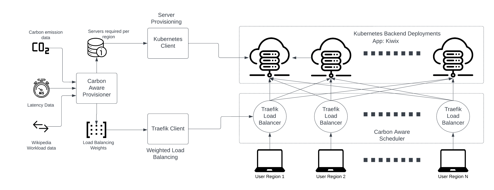

# CASPER
This repository contains information about setting and running CASPER: Carbon-Aware Scheduling and Provisioning for Distributed Web Services. CASPER runs as a Kubernetes Load-balancer. More information can be found on the [paper](https://arxiv.org/abs/2403.14792).

# Code Contributors
Shruti Jasoria, Basundhara Chakrabarty, Abel Souza


# Requirements
1. Docker \
To install docker follow the [official documentation](https://docs.docker.com/engine/install/ubuntu/).
2. kubectl \
To install k8s follow the [official documentation](https://kubernetes.io/docs/tasks/tools/install-kubectl-linux/).
3. metrics-server \
[metrics-server](https://github.com/kubernetes-sigs/metrics-server) can be directly applied to the k8s cluster. The steps are present in the following sections.
4. kubeadm and kubelet \
Follow the [official documentation](https://kubernetes.io/docs/setup/production-environment/tools/kubeadm/install-kubeadm/#installing-kubeadm-kubelet-and-kubectl).
5. Flannel \
[Flannel](https://github.com/flannel-io/flannel) can be directly applied to the k8s cluster.
6. Traefik \
[Download](https://github.com/traefik/traefik/releases) the latest traefik binaries in the kasper directory. Add all the traefik yml config files in the traefik directory.
```
kasper
| - ...
| - traefik
|   | CHANGELOG.md
|   | LICENSE.md
|   | traefik
|   | ALL THE YAML FILES SHOULD BE AT THIS DIRECTORY LEVEL
| - ...
```
7. Prometheus \
[Download](https://prometheus.io/download/) the latest prometheus binaries in the kasper directory. Add all the prometheus yml config files in the traefik directory.
```
kasper
| - ...
| - prometheus
|   | - prometheus-2.44.0-rc.1.linux-amd64
|       | LICENSE
|       | console_libraries
|       | ALL THE YAML FILES SHOULD BE AT THIS DIRECTORY LEVEL
|       - ...
| - ...
```


## Python packages
Use Python 3.x to run the simulation. Required packages are mentioned in the requirements.txt file and can be installed by running the commad:
```
$ pip install -r requirements.txt
```




# Create Kubernetes Setup

## Set up Kuberenets Cluster with Kubeadm and Flannel

We assume a Kubernetes setup with a master node and two worker nodes.
kubectl, kubelet, kubeadm and flannel need to be present in the system

kubeadm setup: https://kubernetes.io/docs/setup/production-environment/tools/kubeadm/install-kubeadm/

1. Disable swap in all the machines. This is required to use kubelet and kubeadm. Once disable, this command need not be run again on the machine.

```
sudo swapoff -a
```

2. Kubelete and docker services should be running before you init kubeadm
```
sudo service docker start
sudo systemctl start kubelet
```

3. Initialise kubeadm
Run the following command in the master node.

```
sudo kubeadm init --pod-network-cidr=10.244.0.0/16 --cri-socket=/run/containerd/containerd.sock
```

Output of the above command:

```
Your Kubernetes control-plane has initialized successfully!

To start using your cluster, you need to run the following as a regular user:

  mkdir -p $HOME/.kube
  sudo cp -i /etc/kubernetes/admin.conf $HOME/.kube/config
  sudo chown $(id -u):$(id -g) $HOME/.kube/config

Alternatively, if you are the root user, you can run:

  export KUBECONFIG=/etc/kubernetes/admin.conf

You should now deploy a pod network to the cluster.
Run "kubectl apply -f [podnetwork].yaml" with one of the options listed at:
  https://kubernetes.io/docs/concepts/cluster-administration/addons/

Then you can join any number of worker nodes by running the following on each as root:

kubeadm join <MASTER_NODE_INTERNAL_NETWORK_IP>:6443 --token ugo1bg.kl76ibmcw8zu4p2v \
        --discovery-token-ca-cert-hash sha256:2a0e87954353e2a74a5f318672bb3cb974a6dc153e92e1db6f056404903c7a65 \
        --cri-socket=/run/containerd/containerd.sock
```

In the above output, make note of two things:
* Remember to replace <MASTER_NODE_INTERNAL_NETWORK_IP> with the IP address of your master node
* Commands to setup kube configs in home directory
* Command to add worker nodes to the cluster

4. Install Flannel

Run the following command on the node with control plane.
```
kubectl apply -f https://raw.githubusercontent.com/coreos/flannel/master/Documentation/kube-flannel.yml
```

5. Join the first and second nodes as worker nodes
```
sudo kubeadm join <MASTER_NODE_INTERNAL_NETWORK_IP>:6443 --token ugo1bg.kl76ibmcw8zu4p2v \
        --discovery-token-ca-cert-hash sha256:2a0e87954353e2a74a5f318672bb3cb974a6dc153e92e1db6f056404903c7a65 \
        --cri-socket=/run/containerd/containerd.sock
```
6. Untaint the control plane node by running:
```
username@master_node:~/casper$ kubectl taint nodes <MASTER_NODE_INTERNAL_NETWORK_IP> node-role.kubernetes.io/control-plane=:NoSchedule-
node/<MASTER_NODE_INTERNAL_NETWORK_IP> untainted
```

## Deploy MetlalLB

Metallb provides the pod network for the kubernetes services to get an IP address. We have used MetalLb version 0.13.9:

```
kubectl apply -f https://raw.githubusercontent.com/metallb/metallb/v0.13.9/config/manifests/metallb-native.yaml
```
```
kubectl apply -f metallb-configmap.yaml
```
To verify if metallb was deployed successfully:
```
kubectl get pod -n metallb-system
```

For eg. :-
```
username@master_node:~/casper$ kubectl get pod -n metallb-system
NAME                          READY   STATUS    RESTARTS   AGE
controller-68bf958bf9-f8kkh   1/1     Running   0          49m
speaker-rmdls                 1/1     Running   0          49m
speaker-s576d                 1/1     Running   0          49m
speaker-sfrzv                 1/1     Running   0          49m
```

To debug any issues with metallb, check the logs of the controller, .i.e.,
```
kubectl logs controller-68bf958bf9-f8kkh -n 
```

## Deploy Metrics Server

Metrics Server allows for monitoring of CPU/Memory usage of the Pods

1. Apply the metrics server manifest:

```
username@master_node:~/casper$ kubectl apply -f metrics-server.yaml
serviceaccount/metrics-server created
clusterrole.rbac.authorization.k8s.io/system:aggregated-metrics-reader created
clusterrole.rbac.authorization.k8s.io/system:metrics-server created
rolebinding.rbac.authorization.k8s.io/metrics-server-auth-reader created
clusterrolebinding.rbac.authorization.k8s.io/metrics-server:system:auth-delegator created
clusterrolebinding.rbac.authorization.k8s.io/system:metrics-server created
service/metrics-server created
deployment.apps/metrics-server created
apiservice.apiregistration.k8s.io/v1beta1.metrics.k8s.io created
```

2. Verify that metrics-server is running:
```
username@master_node:~/casper$ kubectl get pods -n kube-system
NAME                                            READY   STATUS    RESTARTS   AGE
coredns-787d4945fb-2lbgw                        1/1     Running   0          107m
coredns-787d4945fb-8c55z                        1/1     Running   0          107m
etcd-master_node                                1/1     Running   17         107m
kube-apiserver-master_node                      1/1     Running   8          107m
kube-controller-manager-master_node             1/1     Running   8          107m
kube-proxy-62kj5                                1/1     Running   0          107m
kube-proxy-9f5tt                                1/1     Running   0          101m
kube-proxy-p4jxt                                1/1     Running   0          102m
kube-scheduler-master_node                      1/1     Running   8          107m
metrics-server-75b6f9b4fd-9vttd                 0/1     Running   0          9s
```
3. The CPU and Memory usage of pods can now be obtained as follows:
```
username@master_node:~/casper$ kubectl top pods
NAME                                      CPU(cores)   MEMORY(bytes)   
kiwix-serve-us-central-594844fc8f-qr65r   1m           3Mi             
kiwix-serve-us-east-6d485c577f-btsmh      1m           3Mi             
kiwix-serve-us-west-5677c8479f-7p6tc      1m           3Mi  
```

### Debugging
- Preflight fatal error in kubeadm init [ERROR CRI]: container runtime is not running solution: https://github.com/containerd/containerd/issues/4581


## Create Kubernetes Deployments/Services

Now that we have the cluster running, we need to create the Kubernetes setup (deployments, services, etc)
Run the python script "python3 deploy.py" to create the deployment. Or call the method create_kubernetes_setup() from within simulation.py.
CAP/deploy.py contains crucial functions for deployment/ service creation/ destruction.


### Kiwix Image 

Each pod in the Kubernetes deployment runs a Kiwix application image. Check the [Dockerfile](Dockerfile), build the Kiwix container and push it to DockerHub such that Kubernetes can use it. Then, update the registry details in line 217 of ```CAP/deploy.py``` with your own credentials:

```
registry = {
                    "username": "USERNAME",
                    "password": "TOKEN",
                    "email": "YOUR@EMAIL.COM",
                    "registry": "https://index.docker.io/v1/"
                    }
```

Should you choose to run other images, fix the image specification in lines [199-223](CAP/deploy.py#L199). In our experiments, the image was named ```kiwix-serve``` (under ```casperumass/casper:casper-kiwix```) has been uploaded to a private repo on Docker Hub, we recommend doing the same.

### POSSIBLE ISSUES
Container stuck in Container Creating and kubectl describe shows:
```
username@master_node:~/casper$ kubectl get pods
NAME                                      READY   STATUS              RESTARTS   AGE
kiwix-serve-us-central-594844fc8f-vmlrd   0/1     ContainerCreating   0          6m22s
kiwix-serve-us-east-6d485c577f-wff75      0/1     ContainerCreating   0          6m23s
kiwix-serve-us-west-5677c8479f-klwgx      1/1     Running             0          6m23s

  Warning  FailedCreatePodSandBox  79s (x17 over 4m46s)  kubelet            (combined from similar events): Failed to create pod sandbox: rpc error: code = Unknown desc = failed to setup network for sandbox "55873a24810e6f7bd1c4239b674574e17ab4777bc596d34c92c1d5621f95b33d": plugin type="flannel" failed (add): failed to delegate add: failed to set bridge addr: "cni0" already has an IP address different from 10.244.1.1/24
```

This bug is referenced in this [Stackoverflow post](https://stackoverflow.com/questions/61373366/networkplugin-cni-failed-to-set-up-pod-xxxxx-network-failed-to-set-bridge-add

To fix it, check whether the cn01 network interfaces and the flannel.1 IPs match (Use ```ifconfig``` on the workers). If not, run the following commands on the workers:

```
ip link set cni0 down && ip link set flannel.1 down 
ip link delete cni0 && ip link delete flannel.1
systemctl restart docker && systemctl restart kubelet
```

# Run the Simulation

The script ```simulation.py``` runs the end-to-end simulation. 

Call initialize followed by run() to run a complete end to end simulation:

```
def main():
    
    _initialize()
    _run()
    _print_and_save_metrics()
```

The resulting dataframes are saved in the ```dataframes/``` directory and can be exported for analysis.

There are several moving parts in the simulation. We describe them below:

## Traefik Load Balancer

Traefik is a free load balancer that has been used to perform weighted load balancing between the Kubernetes backend services residing on the workers, each representing a region. Every region has its own traefik endpoint. The traefik codes are in ```CAP/deploy.py```.
Trafik has two main configuration files:

- Static Configuration: Contains the entrypoint on which the trafik router listens, and any additional entrypoints for Prometheus, etc. Each region has its own static config in traefik/traefik_{region}.yaml

```
entryPoints:
  web:
   address: "<MASTER_NODE_INTERNAL_NETWORK_IP>:3001"
  metrics:
    address: "<MASTER_NODE_INTERNAL_NETWORK_IP>:4001"
```

For instance, in our internal configuration it contains:
```
entryPoints:
  web:
   address: "192.168.245.71:3001"
  metrics:
    address: "192.168.245.71:4001"
```


- Dynamic Configuration: Contains the router rules (what HTTP traffic to filter) and endpoint config (which services to route traffic to and their weights):

```
services:
    ap-southeast-2:
      loadBalancer:
        servers:
        - url: http://<WORKER_NODE-1_INTERNAL_NETWORK_IP>:30001
    .
    .
    app:
      weighted:
        services:
        - name: ap-southeast-2
          weight: '6'
        .
        .
```

- Note that the ```simulation.py``` script automatically starts traefik and stops it after every execution interval. You will be able to see traefik running processes for each region upon running ```simulation.py```:

username@master_node:~/casper$ ps -ef | grep traefik
```
root      6925     1  0 May22 ?        00:02:10 ./traefik/traefik --configFile traefik/traefik-ap-southeast-2.yaml
root      6926     1  0 May22 ?        00:02:20 ./traefik/traefik --configFile traefik/traefik-eu-central-1.yaml
root      6931     1  0 May22 ?        00:01:37 ./traefik/traefik --configFile traefik/traefik-eu-west-3.yaml
root      6941     1  0 May22 ?        00:02:29 ./traefik/traefik --configFile traefik/traefik-us-east-1.yaml
root      6946     1  0 May22 ?        00:01:21 ./traefik/traefik --configFile traefik/traefik-us-east-2.yaml
root      6955     1  0 May22 ?        00:01:20 ./traefik/traefik --configFile traefik/traefik-us-west-1.yaml
```

- If you need to start traefik manually, the command is: 

```
./traefik/traefik --configFile traefik/traefik-ap-southeast-2.yaml
```

## Prometheus

- Prometheus is a metrics collector that interfaces with the traefik endpoints after every set of HTTP requests is sent, and aggregates them. It provides easy integration with traefik and provides a seamless python API to observe the metrics. The metric collection and aggregation code is located in CAP/metrics.py

- The prometheus config is simple; just add the traefik endpoints to scrape for metrics:
```
scrape_configs:
  - job_name: "prometheus"
    static_configs:
      - targets: ["localhost:9090","<MASTER_NODE_INTERNAL_NETWORK_IP>:4001","<MASTER_NODE_INTERNAL_NETWORK_IP>:4002","<MASTER_NODE_INTERNAL_NETWORK_IP>:4003","<MASTER_NODE_INTERNAL_NETWORK_IP>:4004","<MASTER_NODE_INTERNAL_NETWORK_IP>:4005","<MASTER_NODE_INTERNAL_NETWORK_IP>:4006"]
```

For instance, in our internal configuration we have:
```
scrape_configs:
  - job_name: "prometheus"
    static_configs:
      - targets: ["localhost:9090","192.168.245.71:4001","192.168.245.71:4002","192.168.245.71:4003","192.168.245.71:4004","192.168.245.71:4005","192.168.245.71:4006"]
```

- The exported metrics and their descriptions are available on :
https://doc.traefik.io/traefik/observability/metrics/overview/

- Code to start/stop prometheus is present in ```CAP/deploy.py```

## httpmon Client

[httpmon](https://github.com/cloud-control/httpmon) is used to henerate trafic to run the experiments.

- To run:
```
./httpmon --url http://<MASTER_NODE_INTERNAL_NETWORK_IP>:3000 --thinktime 1 --open --concurrency 1700
```

Instructions to setup httpmon are present on its [github page](https://github.com/cloud-control/httpmon#compiling). Once the setup is complete, copy the files 
 - client/http-mon-client.sh
 - client/concurrency.out

 to httpmon's directory.

 ## Key things to know about the client setup
 - concurrency.out has number of requests that have to be sent per second.
 - Sleep time between request rate updation can be changed by updating the variable  `SLEEP_TIME` on line 14 of http-mon-client.sh.
 - If more request rates are added to concurrency.out, update the variable `N`  on line 16 of http-mon-client.sh.


## AutoScaler

1. Future work: A template autoscaler code is located in autoscaler.py. This code has been tested independently but not during our simulations.

## GoBetWeen (obsolete)

Other load-balancers may be used. We have tested GoBetWeen, but haven't proceeded with it due to issues in the load-balancer's weight updates not being performant. If you want to test it, use the below configurations:

- Config Files are in ```casper/gobetween/config```
- ```update_weights_python.py``` should calculate and update the weights to be used by gobetween
- Start gobetween : ```gobetween -c gobetween/config/gobetween.toml```

```
root@master_node:~/casper/gobetween# gobetween -c config/gobetween.toml
2023/04/22 01:37:47 gobetween v0.8.0
2023-04-22 01:37:47 [INFO ] (manager): Initializing...
2023-04-22 01:37:47 [INFO ] (server): Creating 'sample': <MASTER_NODE_INTERNAL_NETWORK_IP>:3000 roundrobin exec none
2023-04-22 01:37:47 [INFO ] (scheduler): Starting scheduler sample
2023-04-22 01:37:47 [INFO ] (execFetch): Fetching [~/casper/gobetween/config/update_weights_python.py]
2023-04-22 01:37:47 [INFO ] (manager): Initialized
2023-04-22 01:37:47 [INFO ] (metrics): Metrics disabled
2023-04-22 01:37:47 [INFO ] (api): API disabled
2023-04-22 01:37:47 [INFO ] (execFetch): Fetched [{<MASTER_NODE_INTERNAL_NETWORK_IP>:31460 p=1,w=1,l=true,a=0} {<WORKER_NODE-1_INTERNAL_NETWORK_IP>:30897 p=1,w=2,l=true,a=0} {<WORKER_NODE-2_INTERNAL_NETWORK_IP>:32049 p=1,w=2,l=true,a=0}]
```
- curl http://<MASTER_NODE_INTERNAL_NETWORK_IP>:3000 from any node will load balance to the backends:
```
username@master_node:~$ curl http://192.168.245.71:3000

<!DOCTYPE html>
<html xmlns="http://www.w3.org/1999/xhtml">
  <head>
    <meta charset="UTF-8" />
    <meta name="viewport" content="width=device-width,initial-scale=1" />
    <link type="root" href="">
    <title>Welcome to Kiwix Server</title>
    <link
      type="text/css"
      href="/skin/index.css?cacheid=0f9ba34e"
      rel="Stylesheet"
    />
```

# Citing Casper:

```
@inproceedings{souza2023casper,
  title={CASPER: Carbon-Aware Scheduling and Provisioning for Distributed Web Services},
  author={Souza, Abel and Jasoria, Shruti and Chakrabarty, Basundhara and Bridgwater, Alexander and Lundberg, Axel and Skogh, Filip and Ali-Eldin, Ahmed and Irwin, David and Shenoy, Prashant},
  booktitle = {Proceedings of the 14th International Green and Sustainable Computing Conference (IGSC), Toronto, ON, Canada},
  pages={67--73},
  year={2023}
}
```

# Appendix
## Thoughts about mapping request rates vs servers 

- The bottleneck on the server end is CPU cores, the CPU cores reach a max usage (~1 core) much faster than memory does
- Keeping a max of 100 servers/region, let's set 1/100 = 0.01 core/server
- We assign 0.01 core/pod and limit of 0.1 core/pod, set up 6 pods (one for each region), use equal weights for load balancing, and notice that max usage (90+) is reached with 600 requests/sec, or when each pod is getting 100 requests/sec
- Therefore, we can assume that with limit of 0.1 core/pod, the capacity is 100 requests/second
- For 0.01 core/pod as limit, the capacity should be 10 requests/pod/second or 60 requests/sec. This is consistent with our observation:

```
time=1682471572.984567 latency=1:2:2:2:2:(2)ms latency95=2ms latency99=2ms requests=55 option1=0 option2=0 errors=0 throughput=55rps ql=0 rr=0.00% cr=0.00% accRequests=2133 accOption1=0 accOption2=0 accLatency=1:2:2:2:8:(2)ms accLatency95=2ms accLatency99=2ms accOpenQueuing=3 accErrors=0

username@master_node:~/casper# kubectl top pods
NAME                                          CPU(cores)   MEMORY(bytes)   
kiwix-serve-ap-southeast-2-5fc4767cdd-gj6pz   9m           4Mi             
kiwix-serve-eu-central-1-6f66f84858-mhcx2     10m          4Mi             
kiwix-serve-eu-west-3-7f944b6df4-4k5j2        10m          4Mi             
kiwix-serve-us-east-1-64dd6cd7bb-75hz7        10m          4Mi             
kiwix-serve-us-east-2-6f7c4c66c4-r9ql5        10m          4Mi             
kiwix-serve-us-west-1-57879cd54b-stpxx        9m           4Mi  
```

- So, for each pod each server limit = 0.01 core/pod, let base=0.009/pod
- If CAP's servers matrix= [ 5  0 34  0 15  3], CAP should create 6 deployments, with the following CPU resource limits:
0.05,0,0.34,0,0.15,0.03

2023-04-30 22:02:44,640 INFO [INFO] Servers/ Region: [ 8  0 74 28  0  5]
2023-04-30 22:02:44,686 INFO [INFO] server_deployments: {'ap-southeast-2': 8, 'eu-central-1': 0, 'eu-west-3': 74, 'us-east-1': 28, 'us-east-2': 0, 'us-west-1': 5}

```
username@master_node:~$ kubectl get svc
NAME                         TYPE           CLUSTER-IP       EXTERNAL-IP      PORT(S)          AGE
kiwix-serve-ap-southeast-2   LoadBalancer   10.108.248.2     192.168.245.75   8086:30738/TCP   4d16h
kiwix-serve-eu-central-1     LoadBalancer   10.105.134.209   192.168.245.71   8081:31997/TCP   4d16h
kiwix-serve-eu-west-3        LoadBalancer   10.108.43.23     192.168.245.71   8082:30543/TCP   4d16h
kiwix-serve-us-east-1        LoadBalancer   10.103.37.232    192.168.245.74   8083:31159/TCP   4d16h
kiwix-serve-us-east-2        LoadBalancer   10.99.227.233    192.168.245.74   8084:32535/TCP   4d16h
kiwix-serve-us-west-1        LoadBalancer   10.105.157.66    192.168.245.75   8085:31930/TCP   4d16h
kubernetes                   ClusterIP      10.96.0.1        <none>           443/TCP          8d

Requests Redirected: 
([Region(ap-southeast-2), Region(eu-central-1), Region(eu-west-3), Region(us-east-1), Region(us-east-2), Region(us-west-1)],)

[INFO] Verifying update: CPU Limit: 0.081


[INFO] Verifying update: CPU Limit: 0.001


[INFO] Verifying update: CPU Limit: 0.741


[INFO] Verifying update: CPU Limit: 0.281


[INFO] Verifying update: CPU Limit: 0.001


[INFO] Verifying update: CPU Limit: 0.051000000000000004

servers_per_region [ 8  0 74 28  0  5]

[[ 79   0   0   0   0   0]
 [  0   0 500   0   0   0]
 [  0   0 231   0   0   0]
 [  0   0   0 224   0   0]
 [  0   0   0  56   0   0]
```

## Request Load Experiments

```
Running 1700/sec
time=1682135682.356059 latency=1:2:2:2:4:(2)ms latency95=2ms latency99=2ms requests=1823 option1=0 option2=0 errors=0 throughput=1730rps ql=1 rr=0.00% cr=0.00% accRequests=143140 accOption1=0 accOption2=0 accLatency=1:2:2:2:9:(2)ms accLatency95=2ms accLatency99=3ms accOpenQueuing=233 accErrors=0

Usage is <=500 mCPU

username@master_node:~/casper$ kubectl top pods
NAME                                      CPU(cores)   MEMORY(bytes)   
kiwix-serve-us-central-6865bb9cdc-fvrpz   502m         4Mi             
kiwix-serve-us-east-579cbfd99c-626p5      455m         5Mi             
kiwix-serve-us-west-5d9975ffc-448nf       488m         5Mi 


Running 2000/sec

0.00% accRequests=192552 accOption1=0 accOption2=0 accLatency=1:1:2:2:22:(2)ms accLatency95=2ms accLatency99=3ms accOpenQueuing=315 accErrors=0
time=1682135842.526689 latency=1:1:2:2:5:(2)ms latency95=2ms latency99=3ms requests=2197 option1=0 option2=0 errors=0 throughput=2080rps ql=2 rr=0.00% cr=0.00% accRequests=194749 accOption1=0 accOption2=0 accLatency=1:1:2:2:22:(2)ms accLatency95=2ms accLatency99=3ms accOpenQueuing=317 accErrors=0

username@master_node:~/casper$ kubectl top pods
NAME                                      CPU(cores)   MEMORY(bytes)   
kiwix-serve-us-central-6865bb9cdc-fvrpz   579m         4Mi             
kiwix-serve-us-east-579cbfd99c-626p5      527m         5Mi             
kiwix-serve-us-west-5d9975ffc-448nf       547m         5Mi 


Running 2500/sec

time=1682135893.068578 latency=1:1:2:2:5:(2)ms latency95=2ms latency99=2ms requests=2569 option1=0 option2=0 errors=0 throughput=2525rps ql=4 rr=0.00% cr=0.00% accRequests=48300 accOption1=0 accOption2=0 accLatency=1:1:2:2:20:(2)ms accLatency95=2ms accLatency99=4ms accOpenQueuing=85 accErrors=0

username@master_node:~/casper$ kubectl top pods
NAME                                      CPU(cores)   MEMORY(bytes)   
kiwix-serve-us-central-6865bb9cdc-fvrpz   711m         4Mi             
kiwix-serve-us-east-579cbfd99c-626p5      648m         5Mi             
kiwix-serve-us-west-5d9975ffc-448nf       635m         5Mi

Running 3000/sec:

time=1682295940.682874 latency=1:1:2:2:11:(2)ms latency95=2ms latency99=4ms requests=3132 option1=0 option2=0 errors=0 throughput=3056rps ql=4 rr=0.00% cr=0.00% accRequests=64092 accOption1=0 accOption2=0 accLatency=1:1:2:2:26:(2)ms accLatency95=2ms accLatency99=4ms accOpenQueuing=103 accErrors=0

username@master_node:~/casper$ kubectl top pods
NAME                                      CPU(cores)   MEMORY(bytes)   
kiwix-serve-us-central-6865bb9cdc-fvrpz   855m         4Mi             
kiwix-serve-us-east-579cbfd99c-626p5      780m         5Mi             
kiwix-serve-us-west-5d9975ffc-448nf       713m         5Mi  

Running 3500/sec

time=1682295739.191462 latency=1:1:2:2:49:(5)ms latency95=25ms latency99=35ms requests=3625 option1=0 option2=0 errors=0 throughput=3577rps ql=6 rr=0.00% cr=0.00% accRequests=39629 accOption1=0 accOption2=0 accLatency=1:1:2:2:51:(4)ms accLatency95=22ms accLatency99=34ms accOpenQueuing=161 accErrors=0

username@master_node:~/casper$ kubectl top pods
NAME                                      CPU(cores)   MEMORY(bytes)   
kiwix-serve-us-central-6865bb9cdc-fvrpz   901m         4Mi             
kiwix-serve-us-east-579cbfd99c-626p5      894m         5Mi             
kiwix-serve-us-west-5d9975ffc-448nf       790m         5Mi 


Running 4000/sec: Excess: Errors show up:

0 accOption2=0 accLatency=1:1:2:12:111:(9)ms accLatency95=38ms accLatency99=47ms accOpenQueuing=1034 accErrors=0
time=1682296288.557899 latency=1:1:2:12:55:(8)ms latency95=34ms latency99=43ms requests=4180 option1=0 option2=0 errors=0 throughput=3956rps ql=3 rr=0.00% cr=0.00% accRequests=120174 accOption1=0 accOption2=0 accLatency=1:1:2:12:111:(9)ms accLatency95=38ms accLatency99=47ms accOpenQueuing=1066 accErrors=0
time=1682296289.632032 latency=1:1:2:18:61:(11)ms latency95=43ms latency99=51ms requests=4190 option1=0 option2=0 errors=0 throughput=3901rps ql=135 rr=0.00% cr=0.00% accRequests=124364 accOption1=0 accOption2=0 accLatency=1:1:2:12:111:(9)ms accLatency95=38ms accLatency99=47ms accOpenQueuing=1103 accErrors=0
time=1682296294.967543 latency=1:89:482:1224:4828:(790)ms latency95=2589ms latency99=3587ms requests=17181 option1=0 option2=0 errors=0 throughput=3220rps ql=1895 rr=0.00% cr=0.00% accRequests=141545 accOption1=0 accOption2=0 accLatency=1:1:2:23:4828:(104)ms accLatency95=715ms accLatency99=2199ms accOpenQueuing=7269 accErrors=0
time=1682296296.760530 latency=1:83:368:1378:5590:(888)ms latency95=3214ms latency99=4437ms requests=9535 option1=0 option2=0 errors=451 throughput=5066rps ql=989 rr=0.00% cr=0.00% accRequests=151080 accOption1=0 accOption2=0 accLatency=1:1:2:29:5590:(151)ms accLatency95=1128ms accLatency99=2705ms accOpenQueuing=12071 accErrors=451

username@master_node:~/casper$ kubectl top pods
NAME                                      CPU(cores)   MEMORY(bytes)   
kiwix-serve-us-central-6865bb9cdc-fvrpz   872m         20Mi            
kiwix-serve-us-east-579cbfd99c-626p5      873m         20Mi            
kiwix-serve-us-west-5d9975ffc-448nf       826m         21Mi  


At 500/sec:

time=1682316008.392951 latency=1:2:2:2:4:(2)ms latency95=2ms latency99=2ms requests=532 option1=0 option2=0 errors=0 throughput=529rps ql=1 rr=0.00% cr=0.00% accRequests=16601 accOption1=0 accOption2=0 accLatency=1:2:2:2:30:(2)ms accLatency95=2ms accLatency99=3ms 

username@master_node:~/casper$ kubectl top pods
NAME                                      CPU(cores)   MEMORY(bytes)   
kiwix-serve-us-central-6865bb9cdc-fvrpz   134m         21Mi            
kiwix-serve-us-east-579cbfd99c-626p5      133m         21Mi            
kiwix-serve-us-west-5d9975ffc-448nf       136m         21Mi 
```
